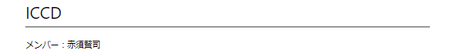

# ICCD

メンバー：赤須賢司

## 1.gitとは

## 2.自分の環境にgitのコードを持ってこよう！！
まずはファイルを作りたいところでgitの初期化を行う。
```
$ mkdir sample
$ cd sample
$ git init
Initialized empty Git repository in /Users/taka/sample/.git/
```


```
# ブランチを指定しない場合
$ git clone [リポジトリのアドレス]
 
# ブランチを指定する場合
$ git clone -b [ブランチ名][リポジトリのアドレス]

#今回は
$ git clone -b dev1 https://github.com/nonadayo/LateSaver.git
```

以下のようになったら成功！
```
Cloning into ‘clone_test’…
remote: Counting objects: 3, done.
remote: Total 3 (delta 0), reused 3 (delta 0), pack-reused 0
Unpacking objects: 100% (3/3), done.
```

## 3.自分のローカル環境で開発ブランチを作成しよう！！
```
# ↓mainにブランチ切替
$ git checkout main
# ↓「dev1」というにブランチ作成
$ git checkout -b dev1
# ↓「dev1」ブランチをGitHub(リモート)にも同じものを作る
$ git push -u origin dev1
# ↓「dev1」ブランチに切替
$ git checkout dev1
```

## 4.開発ブランチでファイルを書き換えてみよう！
の部分に自分の名前を入れてみよう！


```
git add --all
git commit -m "[コメント]"
git push
```

## 5.友達が更新したコードにローカル環境のコードも追いつこう！
```
git pull
```